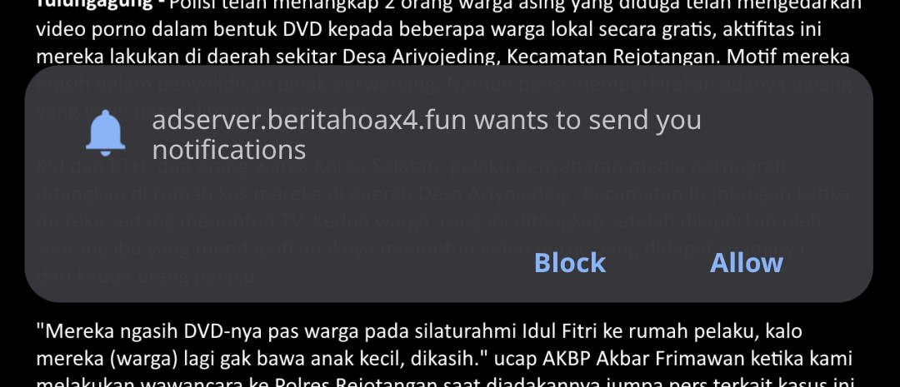

# FloatStat
Simple, plugin-based floating window to show some device status controllable via Notification bar, 
for Android, sprinkled with my (and some of the contributors) ego.

## Features
- **Notification Control** - fast show/hide toggle
- **Completely plugin-based** - Even the internal data provider is a plugin that have minimal 
  ties to the main floating service, See [Plugin Creation](readme/CONTRIBS.MD#plugin) for more info.  
- **Simple** - Customizable, just not yet skinnable 

### Internal Data 
- Network Traffic
- *Kinda Accurate* SoC Temperature, but due to the size nature of a phone, battery temperature might be your best measure
- Battery Temperature
- RAM Usage
- Battery Percentage

## Why?
Have you ever seen this kind of dialog?

On some Phone / ROM (e.g My Nokia 6.1 Plus running Android 10), this kind of dialog cannot be
responded when there is a floating window active due to some security concern. When you try to
respond it, it will ask you to deactivate any floating window before you can really respond the
dialog.

Well, Sometimes it's worth it to re-invent a new kind of wheel when the existing wheels needs too
much energy to roll over or is designed to work by constantly trampling your toes.

For some more info, See [Why](readme/WHY.MD)

## License
Apache License 2.0, with some file is under Public Domain.